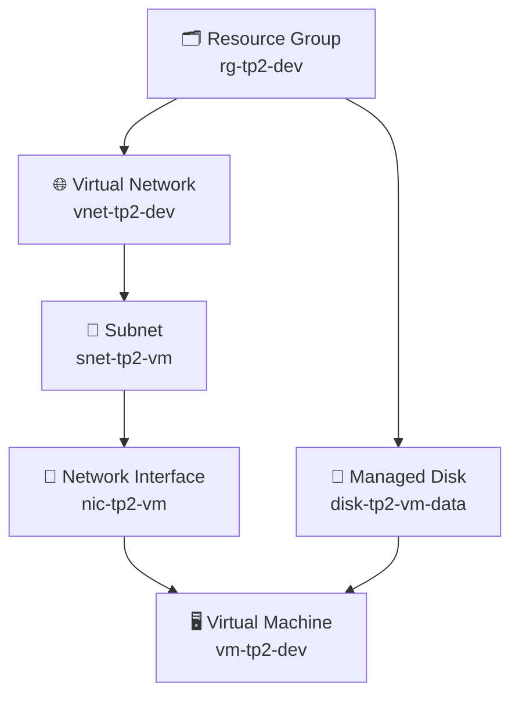

# 📦 Contexte

Vous allez construire pas à pas une infrastructure Azure complète : réseau, machine virtuelle, disque, carte réseau. Le TP est découpé en quatre parties progressives. **Chaque partie s'appuie sur la précédente** - ne passez pas à la suivante sans avoir validé l'étape en cours.



---

## 🎯 Objectifs

<div class="section objective">

1. Structurer un projet Terraform multi-fichiers avec provider et backend
2. Déployer un réseau complet (VNet, Subnet) et une VM avec ses ressources associées
3. Paramétrer l'infrastructure avec des variables validées et exposer des outputs
4. Comprendre les dépendances implicites et explicites (`depends_on`, `data`)
5. Livrer un projet propre : conventions de nommage, tags, documentation, structure finale

</div>

---

## 🗂️ Partie 2.1 - Infrastructure de base

> **Point de départ :** un nouveau dossier vide. À la fin de cette partie, vous aurez un réseau fonctionnel sur Azure.

---

### 📝 Étape 2.1.1 - Créer la structure du projet

Un projet Terraform bien organisé ne tient pas dans un seul fichier. La convention courante est de séparer les responsabilités dès le départ.

**Ce que vous devez faire :**

- Créez un dossier `tp2-infra/` et placez-vous dedans.
- Créez `providers.tf` avec la configuration du provider et du backend. A partir du template ci-dessous

```hcl
terraform {
  required_providers {
    ...
  }

  # Backend local explicite (par défaut, mais bonne pratique de le déclarer)
  ...
}

provider "azurerm" {
  features {}
}
```

{::nomarkdown}
<details><summary>Solution - Étape 2.1.1</summary>
{:/nomarkdown}

Contenu de `providers.tf` :

```hcl
terraform {
  required_providers {
    azurerm = {
      source  = "hashicorp/azurerm"
      version = "~> 4.0"
    }
  }

  # Backend local explicite (par défaut, mais bonne pratique de le déclarer)
  backend "local" {
    path = "terraform.tfstate"
  }
}

provider "azurerm" {
  features {}
}
```

```bash
terraform init
```

{::nomarkdown}
</details>
{:/nomarkdown}

---

### 📝 Étape 2.1.2 - Resource Group, VNet et Subnet

Vous allez créer les trois briques réseau fondamentales. Lisez la documentation de chaque ressource avant d'écrire la configuration.

**Ce que vous devez faire :**

Créez `main.tf` et déclarez les trois ressources suivantes:
- **`azurerm_resource_group`** - nommé `rg-tp2-dev`
- **`azurerm_virtual_network`** - nommé `vnet-tp2-dev`, avec l'espace d'adressage `10.0.0.0/16`
- **`azurerm_subnet`** - nommé `snet-tp2-vm`, avec le préfixe `10.0.1.0/24`

Template `main.tf` : 

```hcl
resource "azurerm_resource_group" "rg" {
 ...
}

resource "azurerm_virtual_network" ... {
  name                = ...
  location            = ...
  resource_group_name = ...
  # Espace d'adressage 10.0.0.0/16
}

resource "azurerm_subnet" ... {
  ...
  # préfixe du subnet : 10.0.1.0/24
}
```

> 💡 Cherchez dans la [documentation azurerm](https://registry.terraform.io/providers/hashicorp/azurerm/latest/docs) les arguments requis pour chaque ressource. Observez comment les ressources se **référencent entre elles**.

**Questions de réflexion :**
- Comment Terraform détermine-t-il l'ordre de création des ressources ?
- Quel est la différence entre le nom `azurerm_resource_group rg` et `name = rg-tp2-dev` ?
- Comment créer un second subnet attaché au vnet `vnet-tp2-dev` ?

{::nomarkdown}
<details><summary>Solution - Étape 2.1.2</summary>
{:/nomarkdown}

Contenu de `main.tf` :

```hcl
resource "azurerm_resource_group" "rg" {
  name     = "rg-tp2-dev"
  location = "West Europe"
}

resource "azurerm_virtual_network" "vnet" {
  name                = "vnet-tp2-dev"
  location            = azurerm_resource_group.rg.location
  resource_group_name = azurerm_resource_group.rg.name
  address_space       = ["10.0.0.0/16"]
}

resource "azurerm_subnet" "snet_vm" {
  name                 = "snet-tp2-vm"
  resource_group_name  = azurerm_resource_group.rg.name
  virtual_network_name = azurerm_virtual_network.vnet.name
  address_prefixes     = ["10.0.1.0/24"]
}
```

```bash
terraform plan
terraform apply
```

{::nomarkdown}
</details>
{:/nomarkdown}

---

## 🗂️ Partie 2.2 - Variables, VM et Outputs

> **Prérequis :** l'infrastructure de la partie 2.1 est déployée. Votre formateur va apporter du contexte sur les variables HCL avant cette partie.

---

### 📝 Étape 2.2.1 - Ajouter NIC, Disque de données et VM

Vous allez compléter l'infrastructure avec les ressources de calcul.

**Ce que vous devez faire :**

Ajoutez dans `main.tf` les ressources suivantes, en les référençant correctement sur le subnet existant :

1. **`azurerm_network_interface`** - une NIC attachée au subnet `snet-tp2-vm`, avec une IP privée dynamique
2. **`azurerm_managed_disk`** - un disque de données de 32 Go, type `Standard_LRS`
3. **`azurerm_linux_virtual_machine`** - une VM Ubuntu 22.04 LTS, taille `Standard_B1s`, utilisant la NIC ci-dessus
4. **`azurerm_virtual_machine_data_disk_attachment`** - pour attacher le disque à la VM

> 💡 Pour la VM, consultez la doc `azurerm_linux_virtual_machine`. Faites attention aux blocs `os_disk`, `source_image_reference` et à l'authentification. Pour l'attachement du disque, cherchez le `lun` (Logical Unit Number).

**Questions de réflexion :**
- Pourquoi utiliser `disable_password_authentication = false` est déconseillé en production ?
- Qu'est-ce qu'un `lun` dans le contexte d'un disque Azure ?

{::nomarkdown}
<details><summary>Solution - Étape 2.2.1</summary>
{:/nomarkdown}

Ajout dans `main.tf` :

```hcl
resource "azurerm_network_interface" "nic" {
  name                = "nic-tp2-vm"
  location            = azurerm_resource_group.rg.location
  resource_group_name = azurerm_resource_group.rg.name

  ip_configuration {
    name                          = "internal"
    subnet_id                     = azurerm_subnet.snet_vm.id
    private_ip_address_allocation = "Dynamic"
  }
}

resource "azurerm_managed_disk" "data_disk" {
  name                 = "disk-tp2-vm-data"
  location             = azurerm_resource_group.rg.location
  resource_group_name  = azurerm_resource_group.rg.name
  storage_account_type = "Standard_LRS"
  create_option        = "Empty"
  disk_size_gb         = 32
}

resource "azurerm_linux_virtual_machine" "vm" {
  name                            = "vm-tp2-dev"
  location                        = azurerm_resource_group.rg.location
  resource_group_name             = azurerm_resource_group.rg.name
  size                            = "Standard_B1s"
  admin_username                  = "adminuser"
  admin_password                  = "P@ssw0rd1234!"
  disable_password_authentication = false

  network_interface_ids = [azurerm_network_interface.nic.id]

  os_disk {
    caching              = "ReadWrite"
    storage_account_type = "Standard_LRS"
  }

  source_image_reference {
    publisher = "Canonical"
    offer     = "0001-com-ubuntu-server-jammy"
    sku       = "22_04-lts"
    version   = "latest"
  }
}

resource "azurerm_virtual_machine_data_disk_attachment" "data_disk_attach" {
  managed_disk_id    = azurerm_managed_disk.data_disk.id
  virtual_machine_id = azurerm_linux_virtual_machine.vm.id
  lun                = 0
  caching            = "ReadWrite"

  depends_on = [azurerm_linux_virtual_machine.vm]
}
```

{::nomarkdown}
</details>
{:/nomarkdown}

---

### 📝 Étape 2.2.2 - Déclarer des variables avec validation

Les valeurs en dur dans `main.tf` sont une mauvaise pratique. Vous allez les extraire en variables.

**Ce que vous devez faire :**

Dans `variables.tf`, déclarez au minimum les variables suivantes avec leur type, leur description et une valeur par défaut :

| Variable | Type | Exemple |
|---|---|---|
| `location` | `string` | `"West Europe"` |
| `environment` | `string` | `"dev"` |
| `vm_size` | `string` | `"Standard_B1s"` |
| `admin_password` | `string` | _(pas de défaut - sensible)_ |

Ajoutez une **validation** sur `environment` pour n'accepter que `dev`, `staging` ou `prod`.

Refactorisez ensuite `main.tf` pour utiliser ces variables (`var.location`, `var.environment`, etc.).

> 💡 Consultez la doc sur les [Custom Conditions](https://developer.hashicorp.com/terraform/language/expressions/custom-conditions). Testez un passage de valeur invalide : `terraform plan -var="environment=recette"`.

**Questions de réflexion :**
- Comment passer une variable depuis la ligne de commande ? Depuis un fichier `.tfvars` ?
- Pourquoi ne jamais mettre de valeur par défaut sur une variable de mot de passe ?

{::nomarkdown}
<details><summary>Solution - Étape 2.2.2</summary>
{:/nomarkdown}

Contenu de `variables.tf` :

```hcl
variable "location" {
  type        = string
  description = "Région Azure pour toutes les ressources"
  default     = "West Europe"
}

variable "environment" {
  type        = string
  description = "Environnement de déploiement (dev, staging, prod)"
  default     = "dev"

  validation {
    condition     = contains(["dev", "staging", "prod"], var.environment)
    error_message = "La variable environment doit être 'dev', 'staging' ou 'prod'."
  }
}

variable "vm_size" {
  type        = string
  description = "Taille de la machine virtuelle Azure"
  default     = "Standard_B1s"
}

variable "admin_password" {
  type        = string
  description = "Mot de passe administrateur de la VM"
  sensitive   = true
}
```

Créez un fichier `terraform.tfvars` (à ne **pas** commiter) :

```hcl
admin_password = "P@ssw0rd1234!"
```

Testez le passage d'une valeur invalide :

```bash
terraform plan -var="environment=recette"
```

{::nomarkdown}
</details>
{:/nomarkdown}

---

### 📝 Étape 2.2.3 - Déclarer des outputs

Les outputs permettent d'exposer des informations sur l'infrastructure après l'apply.

**Ce que vous devez faire :**

Dans `outputs.tf`, déclarez au minimum :

1. L'**adresse IP privée** de la VM (depuis la NIC)
2. Le **nom du Resource Group** créé
3. L'**ID de la VM**

Après l'apply, consultez les outputs avec la commande dédiée.

> 💡 L'attribut `private_ip_address` est exporté directement par `azurerm_network_interface`. Explorez les attributs disponibles dans la documentation de chaque ressource, section "Attributes Reference".

{::nomarkdown}
<details><summary>Solution - Étape 2.2.3</summary>
{:/nomarkdown}

Contenu de `outputs.tf` :

```hcl
output "vm_private_ip" {
  description = "Adresse IP privée de la VM"
  value       = azurerm_network_interface.nic.private_ip_address
}

output "resource_group_name" {
  description = "Nom du Resource Group"
  value       = azurerm_resource_group.rg.name
}

output "vm_id" {
  description = "ID Azure de la VM"
  value       = azurerm_linux_virtual_machine.vm.id
}
```

Après apply :

```bash
terraform output
terraform output vm_private_ip
```

{::nomarkdown}
</details>
{:/nomarkdown}

---

## 🗂️ Partie 2.3 - Data sources et dépendances explicites

> **Prérequis :** la VM de la partie 2.2 est déployée. Votre formateur présentera le concept de `data source` avant cette partie.
>
> **Contexte :** une deuxième équipe doit installer **nginx** sur la VM existante. Elle travaille dans un **projet Terraform séparé** et n'a pas accès au code source de la partie 2.2 - elle doit interroger Azure pour retrouver les ressources.

---

### 📝 Étape 2.3.1 - Nouveau projet et data sources

**Ce que vous devez faire :**

- Créez un nouveau dossier `tp2-nginx/` avec un `providers.tf` et un `main.tf`.
- Utilisez des **data sources** (`data`) pour retrouver la VM et le Resource Group créés en 2.2, sans les recréer.
- Cherchez dans la doc : `azurerm_resource_group` (data source), `azurerm_linux_virtual_machine` (data source).

> 💡 Un `data` source **lit** une ressource existante dans Azure. Il ne la crée pas et ne la gère pas. C'est la différence fondamentale avec un bloc `resource`.

**Questions de réflexion :**
- Que se passe-t-il si la ressource cherchée n'existe pas dans Azure au moment du `terraform plan` ?
- Quelle est la différence entre `data.azurerm_linux_virtual_machine.vm.id` et `azurerm_linux_virtual_machine.vm.id` ?

{::nomarkdown}
<details><summary>Solution - Étape 2.3.1</summary>
{:/nomarkdown}

```bash
mkdir tp2-nginx && cd tp2-nginx
```

`providers.tf` : identique à la partie 2.1.

Contenu de `main.tf` :

```hcl
data "azurerm_resource_group" "rg" {
  name = "rg-tp2-dev"
}

data "azurerm_linux_virtual_machine" "vm" {
  name                = "vm-tp2-dev"
  resource_group_name = data.azurerm_resource_group.rg.name
}
```

```bash
terraform init
terraform plan
```

> `terraform plan` interroge Azure et confirme que les ressources existent. Aucune modification n'est planifiée.

{::nomarkdown}
</details>
{:/nomarkdown}

---

### 📝 Étape 2.3.2 - Installer nginx avec `azurerm_virtual_machine_extension`

**Ce que vous devez faire :**

- Ajoutez dans `main.tf` une ressource `azurerm_virtual_machine_extension` qui installe nginx via un script bash.
- Utilisez `depends_on` pour forcer l'exécution après la résolution du data source.

> 💡 La ressource `azurerm_virtual_machine_extension` de type `CustomScript` permet d'exécuter un script shell. Consultez la [documentation](https://registry.terraform.io/providers/hashicorp/azurerm/latest/docs/resources/virtual_machine_extension). Le champ `settings` attend du JSON - utilisez la fonction `jsonencode()`.

**Questions de réflexion :**
- Pourquoi utilise-t-on `depends_on` ici alors que la VM est déjà référencée via un `data` ?
- Que se passe-t-il si vous relancez `terraform apply` une deuxième fois ? L'extension est-elle réinstallée ?

{::nomarkdown}
<details><summary>Solution - Étape 2.3.2</summary>
{:/nomarkdown}

Ajout dans `main.tf` :

```hcl
resource "azurerm_virtual_machine_extension" "nginx" {
  name                 = "install-nginx"
  virtual_machine_id   = data.azurerm_linux_virtual_machine.vm.id
  publisher            = "Microsoft.Azure.Extensions"
  type                 = "CustomScript"
  type_handler_version = "2.1"

  settings = jsonencode({
    commandToExecute = "apt-get update && apt-get install -y nginx && systemctl enable nginx && systemctl start nginx"
  })

  depends_on = [data.azurerm_linux_virtual_machine.vm]
}
```

```bash
terraform apply
```

{::nomarkdown}
</details>
{:/nomarkdown}

---

## 🗂️ Partie 2.4 - Projet final structuré

> **Prérequis :** les parties 2.1 et 2.2 sont terminées. Votre formateur abordera les conventions de nommage et la documentation avant cette partie.
>
> Vous allez **repartir du projet `tp2-infra`** et le transformer en un projet de qualité production.

---

### 📝 Étape 2.4.1 - Tags, documentation et conventions

**Ce que vous devez faire :**

- Créez un fichier `locals.tf` avec un bloc `locals` centralisant les tags communs : `environment`, `project = "tp2"`, `managed_by = "terraform"`.
- Appliquez ces tags sur toutes les ressources Azure qui les supportent via `local.common_tags`.
- Ajoutez un **commentaire de description** au-dessus de chaque bloc `resource`.
- Vérifiez que tous les labels locaux Terraform suivent la convention **`snake_case`** (`snet_vm`, `data_disk`, etc.).
- Créez un `README.md` décrivant l'architecture, les prérequis et les commandes de déploiement.

> 💡 La fonction [`merge()`](https://developer.hashicorp.com/terraform/language/functions/merge) permet de fusionner les tags communs avec des tags spécifiques à une ressource si nécessaire.

{::nomarkdown}
<details><summary>Solution - Étape 2.4.1</summary>
{:/nomarkdown}

Contenu de `locals.tf` :

```hcl
locals {
  common_tags = {
    environment = var.environment
    project     = "tp2"
    managed_by  = "terraform"
  }
}
```

Exemple de ressource avec tags et commentaire :

```hcl
# Resource Group principal - conteneur de toutes les ressources du projet
resource "azurerm_resource_group" "rg" {
  name     = "rg-tp2-${var.environment}"
  location = var.location
  tags     = local.common_tags
}
```

Ajoutez `tags = local.common_tags` de la même façon sur `azurerm_virtual_network`, `azurerm_network_interface`, `azurerm_managed_disk` et `azurerm_linux_virtual_machine`.

{::nomarkdown}
</details>
{:/nomarkdown}

---

### 🗂️ Étape 2.5 - Expérimenter la dérive d'état

Ces exercices vous permettent d'observer ce qui se passe quand l'état Terraform est altéré. Procédez **dans l'ordre** et notez vos observations.

**Exercice A - Supprimer le tfstate :**

1. Sauvegardez le fichier `terraform.tfstate` (copiez-le ailleurs).
2. Supprimez `terraform.tfstate`.
3. Lancez `terraform plan`. Qu'observez-vous ? Pourquoi ?
4. Cherchez la commande `terraform import` dans la documentation. Réimportez le Resource Group.

> ⚠️ Ne lancez **pas** `terraform apply` après avoir supprimé le tfstate sans avoir réimporté les ressources - cela créerait des doublons dans Azure.

**Exercice B - Supprimer une ressource directement dans Azure :**

1. Restaurez votre tfstate.
2. Supprimez **manuellement** le subnet dans le portail Azure.
3. Lancez `terraform plan`. Que propose Terraform ?
4. Lancez `terraform apply`. Que se passe-t-il ?

<div class="section tasks">

Notez vos observations pour chaque exercice - votre formateur en fera une synthèse en groupe.

</div>

{::nomarkdown}
<details><summary>Solution - Étape 2.4.2</summary>
{:/nomarkdown}

**Exercice A :**

Sans tfstate, Terraform ne connaît plus l'infrastructure existante et planifie la **création de toutes les ressources**. C'est pourquoi le state est critique.

Réimporter le Resource Group :

```bash
terraform import azurerm_resource_group.rg \
  /subscriptions/<subscription_id>/resourceGroups/rg-tp2-dev
```

Répétez l'import pour chaque ressource, puis relancez `terraform plan` - il ne devrait plus planifier de création.

**Exercice B :**

Terraform détecte la dérive et planifie **uniquement** la recréation du subnet supprimé - pas des autres ressources. C'est l'idempotence en action.

```bash
terraform apply  # recrée uniquement le subnet manquant
```

{::nomarkdown}
</details>
{:/nomarkdown}

---

## ✅ Résultat attendu

<div class="section objective">

À la fin du TP 2, votre projet `tp2-infra/` doit contenir :

| Fichier | Contenu |
|---|---|
| `providers.tf` | Provider azurerm + backend local |
| `variables.tf` | Variables typées, décrites, validées |
| `locals.tf` | Tags communs centralisés |
| `main.tf` | RG, VNet, Subnet, NIC, Disk, VM, Attachment - commentés |
| `outputs.tf` | IP privée, nom du RG, ID VM |
| `terraform.tfvars` | Valeurs sensibles (non commité) |
| `README.md` | Description de l'architecture |

Toutes les ressources sont visibles dans le portail Azure avec les tags `environment`, `project` et `managed_by`.

</div>

---

## 🧹 Nettoyage

Détruisez les deux projets dans l'ordre pour éviter des erreurs de dépendance.

{::nomarkdown}
<details><summary>Solution - Nettoyage</summary>
{:/nomarkdown}

```bash
# 1. Détruire le projet nginx en premier (dépend de la VM)
cd tp2-nginx
terraform destroy

# 2. Détruire l'infrastructure principale
cd ../tp2-infra
terraform destroy
```

Vérifiez dans le portail Azure que le Resource Group `rg-tp2-dev` a bien été supprimé.

{::nomarkdown}
</details>
{:/nomarkdown}
